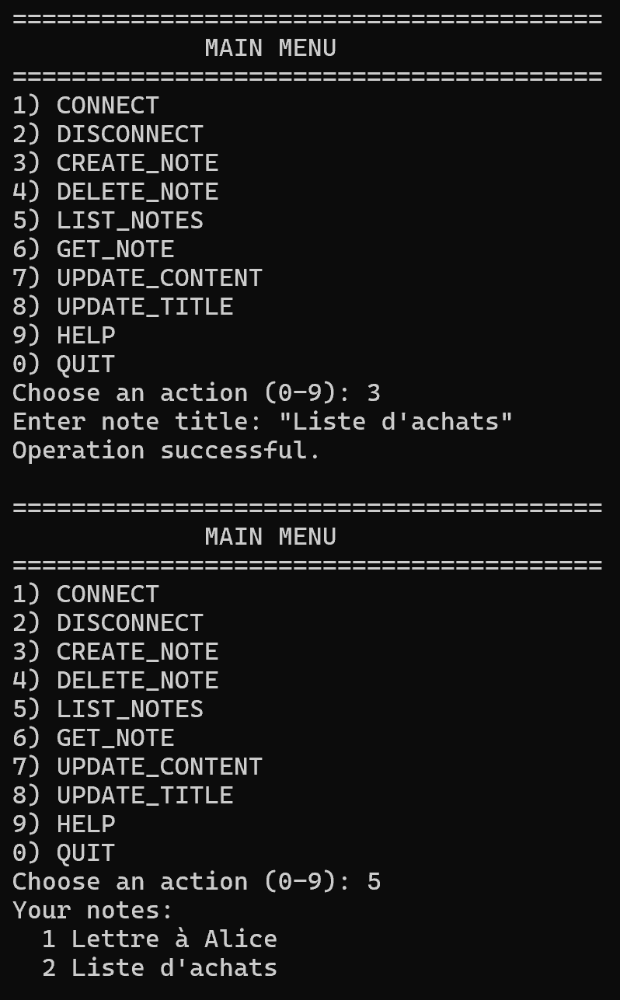

# No-tion

## Table of Contents

- [About](#about)
- [Features](#features)
- [Installation and usage](#installation-and-usage)
- [Using Docker](#using-docker)
- [Examples](#examples)
- [Contributing](#contributing)

## About

No-tion is a simple note-taking application that allows you to create, read, update and delete notes using a [custom-made TCP protocol](https://heig-vd-dai-iseni-jacobs.github.io/no-tion/application_protocol.html).

It was developed as a project for the HEIG-VD [Web Application Development](https://github.com/heig-vd-dai-course) course in the 2024-2025 academic year.

## Features

- Create, read, update and delete notes
- Multiple users
- Concurrent access to notes

## Installation and usage

### Prerequisites

- **Java JDK 21**
- **Maven** for dependency management and building the project
- **Git** for cloning the repository
- **IntelliJ IDEA** (optional) for easier setup

### Clone the Repository

Open your terminal and run the following command to clone the repository:

```bash
git clone git@github.com:HEIG-VD-DAI-Iseni-Jacobs/no-tion.git
```

### Build and run

<details>
<summary>Using the Terminal</summary>
<br>

#### Build the Project

Navigate to the cloned project directory and use Maven to build the application:

```bash
cd no-tion
mvn spotless:apply dependency:go-offline clean compile package
```

#### Usage

Once the project is built, you can run the application using the following command:

```bash
java -jar target/no-tion-1.0-SNAPSHOT.jar <command>
```

The application provides a command-line interface where you can choose the desired options.

#### Optional parameter

1. **-p <port>** specifies the port number to use for the server. If not provided, the default port 16447 will be used.
2. **-h <host>** specifies the host address to use for the client. If not provided, the default host "localhost" will be used.

#### Available Commands

1. **server**
2. **client**

Select the desired option by entering the corresponding name.
</details>

<details open>
<summary>Using IntelliJ IDEA</summary>
<br>

#### Build

In the "Run" tab, select `Package application as JAR file` and run it.

#### Run

In the "Run" tab, select `Run the server` then `Run a client` and run it (and `Run another client` to test multi-client support).
Feel free to update the run config or launch the app from the terminal to add your parameters !
For more details on the commands see Available Commands.

</details>

## Using Docker

The application can be run using docker. There's two options: build the docker image yourself or use the one we provide in our github container registry.

### Get a Docker image of the application

#### Build docker image

Easiest way to build the docker image is to use the `build.sh` script. Open a terminal in the project directory and run (you may need to run `chmod +x build.sh` to run the script):

```bash
./build.sh
```

<details>
<summary>Manual way</summary>
<br>

```bash
docker build --no-cache=true --build-arg BUILD_DATE=$(date -u +'%Y-%m-%dT%H:%M:%SZ') -t no-tion .
```
- `BUILD_DATE` is optional, if not set il will just be empty. Note that `--no-cache=true` is required if you set `BUILD_DATE`
- replace `no-tion` with `ghcr.io/heig-vd-dai-iseni-jacobs/no-tion:latest` if you want to push to the github container registry

</details>
<br>

#### Get the docker image from the github container registry

```bash
docker pull ghcr.io/heig-vd-dai-iseni-jacobs/no-tion:latest
```

### Run the docker image

Run server on docker :
```bash
docker run -p 16447:16447 ghcr.io/heig-vd-dai-iseni-jacobs/no-tion server
```

You'll still need to run the client locally, for example using IntelliJ IDEA run config `Run a client`. (or see [Build and run](#build-and-run))

## Examples

Example of connection:


Basic examples of usage:

1. Help message:


2. Create a note and list all notes:



## Contributing

Contributions are welcome! To contribute:

1. Create an issue describing the feature you want to implement
2. Fork the project and clone it
3. Create your feature branch

````shell
git checkout -b feature/my-feature
````

4. Commit your changes

````shell
git commit -m "Add my feature"
````

5. Push the branch

```shell
git push
```

6. Open a Pull Request

If you have any questions or suggestions, feel free to open
an [issue](https://github.com/HEIG-VD-DAI-Iseni-Jacobs/pictures-cli-editor/issues) on GitHub.

7. Push to the github container registry (optional)

```bash
docker push ghcr.io/heig-vd-dai-iseni-jacobs/no-tion
```
