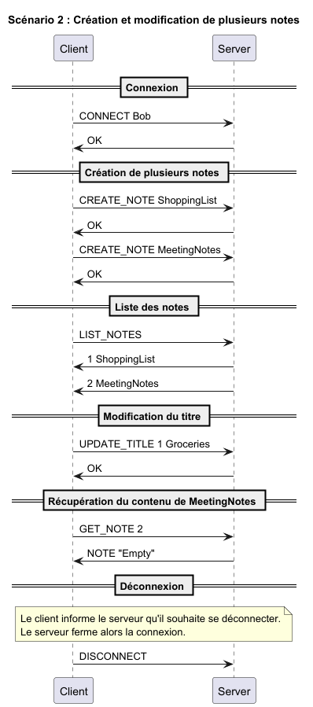

# The "No-Tion" Application Protocol

## Overview
Le protocole de l'application "No-Tion" est un protocole de communication qui permet à un client de gérer ses notes en communiquant avec un serveur.

## Transport protocol
Il utilise le protocole de transport TCP pour assurer la fiabilité de la transmission des données.

Le port qu'il utilise est le numéro de port 16447.

Le protocole de l'application "No-Tion" est un protocole de transport de texte où chaque message doit être encodé en UTF-8 et délimité par un caractère de nouvelle ligne (`\n`).

Les paramètres composés d'espaces doivent être mis entre guillemets doubles (`"`).

Les messages sont traités comme des messages textuels.

La connexion initiale doit être établie par le client.

Une fois la connexion établie, le client peut envoyer des commandes au serveur pour gérer ses notes.

Le serveur doit vérifier si les commandes reçues sont valides et les exécuter.

Si une commande est invalide, le serveur doit renvoyer un message d'erreur au client.

Sur un message inconnu, le serveur doit renvoyer un message d'erreur au client.

## Messages

### Connexion
Le client envoie une commande de connexion au serveur pour s'authentifier avec son nom d'utilisateur.

#### Requête
```text
CONNECT <name>
```

#### Réponse
```text
    OK : connexion réussie
ERROR <code> : connexion échouée
```
*Codes d'erreurs : [3](#error-3)*

### Déconnexion
Le client envoie une commande de déconnexion au serveur pour se déconnecter.

#### Requête
```text
DISCONNECT
```

#### Réponse
None.

### Création d'une note
Le client envoie une commande de création de note au serveur.
Pour simplifier le code, le client devra d'abord créer une note, puis la modifier pour ajouter le contenu.

#### Requête
```text
CREATE_NOTE <titre>
```

#### Réponse
```text
OK
ERROR <code> : erreur lors de la création de la note
```
*Codes d'erreurs : [2](#error-2), [3](#error-3)*

### Suppression d'une note
Le client envoie une commande de suppression de note au serveur.

#### Requête
```text
DELETE_NOTE <titre>
```

#### Réponse
```text
OK
ERROR <code> : erreur lors de la suppression de la note
```
*Codes d'erreurs : [1](#error-1), [3](#error-3)*

### Liste des notes
Le client envoie une commande pour obtenir la liste des notes au serveur.

#### Requête
```text
LIST_NOTES
```

#### Réponse
```text
1 <titre de la note 1>
2 <titre de la note 2>
...
n <titre de la note n>
```

### Récupération d'une note
Le client envoie une commande pour récupérer une note au serveur.

#### Requête
```text
GET_NOTE <index>
```

#### Réponse
```text
NOTE <contenu>
ERROR <code> : erreur lors de la récupération de la note
```
*Codes d'erreurs : [1](#error-1), [3](#error-3)*

### Modification du contenu d'une note
Le client envoie une commande pour modifier une note au serveur.

#### Requête
```text
UPDATE_CONTENT <index> <nouveau contenu>
```

#### Réponse
```text
OK
ERROR <code> : erreur lors de la modification du contenu de la note
```
*Codes d'erreurs : [1](#error-1)*

### Modification du titre d'une note
Le client envoie une commande pour modifier le titre d'une note au serveur.

#### Requête
```text
UPDATE_TITLE <index> <nouveau titre>
```

#### Réponse
```text
OK
ERROR <code> : erreur lors de la modification du titre de la note
```
*Codes d'erreurs : [1](#error-1), [2](#error-2), [3](#error-3)*


### Erreurs
Le serveur envoie un message d'erreur au client si une des requêtes est invalide.

#### Réponse
```text
ERROR <code>
```

Les codes d'erreur sont les suivants :
- <a id="error-1">-1</a> : not found (Note inexistante)
- <a id="error-2">-2</a> : conflict (Note déjà existante)
- <a id="error-3">-3</a> : syntax error (Commande inconnue ou incorrecte, ex. connect alors que l'utilisateur est déjà connecté)

## Exemples

### Exemple pour la création d'une note


### Exemple pour la création et la modification de plusieurs notes


### Exemple pour la gestion des erreurs


### Exemple pour la réorganisation des titres et suppression de notes


### Exemple complet avec erreurs et succès

